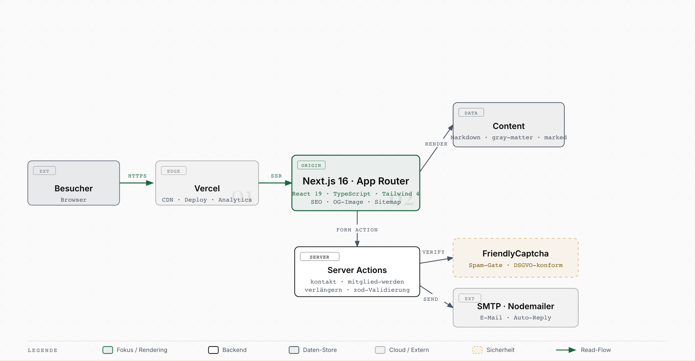

# oakwoodgolfclub-website

> Rendered from the interactive source: [`docs/diagrams/architecture.html`](./docs/diagrams/architecture.html).

Redesign of [oakwoodgolfclub.de](https://oakwoodgolfclub.de) — a remote golf club membership service (Fernmitgliedschaft) run by the maintainer as a 16-year side-hustle. ~300 active members across DACH and internationally (Thailand, Brazil, UK, India, Denmark, Italy). Primary features: handicap management, printed membership cards, FAQ + blog.

This repo is in **briefing stage**. No code yet. Scope, tech, design — all TBD. The current site runs on WordPress; this project plans the next-generation replacement. See [BRIEFING.md](./BRIEFING.md) for context, business facts, and 12 open scope questions.

Unlike the maintainer's other personal projects, OGC is a **live business** with real members and real revenue. Member data discipline matters — see [CLAUDE.md](./CLAUDE.md).

## Estate test-scope stats

This repo is a producer for the Neckarshore estate [test-scope pipeline](https://github.com/neckarshore-ai/neckarshore-planning/blob/main/docs/reference/stats-json-contract.md). On every push to `main`, the `emit-stats` job in [`.github/workflows/e2e.yml`](./.github/workflows/e2e.yml) publishes a contract-conformant `stats.json` (the CI-gated Playwright e2e count) to a dedicated **`stats-data`** branch.

`stats.json` lives on `stats-data`, **not** on `main`, on purpose: `main` is branch-protected (required checks: ESLint, Playwright E2E, npm audit), and the CI bot cannot — and must not — push data commits past those gates. `stats-data` is an unprotected single-file data branch, so the emit keeps `main`'s protection 100% intact (Approach E; trustscope precedent). The [aggregator](https://github.com/neckarshore-ai/neckarshore-website) fetches this file with `?ref=stats-data` (`statsRef` in its `stats-config.json`).
